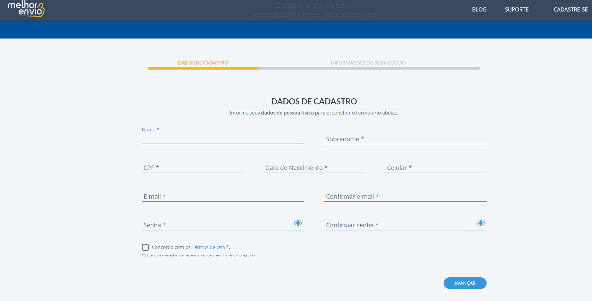

# Cadastro de clientes - Automação Cypress

[![NPM Version][npm-image]][npm-url]
[![Build Status][travis-image]][travis-url]
[![Downloads Stats][npm-downloads]][npm-url]


Automation scenarios involving customer registration in the cadastro de clientes in Melhor Envio.




## Development setup

For the development of automation, the Cypress testing framework was used, with the JS language. 

Dependencies

```sh
make install requires nodejs and cypress
```

## Run test

run test
```sh
npx cypress open
```


<!-- Markdown link & img dfn's -->
[npm-image]: https://img.shields.io/npm/v/datadog-metrics.svg?style=flat-square
[npm-url]: https://npmjs.org/package/datadog-metrics
[npm-downloads]: https://img.shields.io/npm/dm/datadog-metrics.svg?style=flat-square
[travis-image]: https://img.shields.io/travis/dbader/node-datadog-metrics/master.svg?style=flat-square
[travis-url]: https://travis-ci.org/dbader/node-datadog-metrics
[wiki]: https://github.com/yourname/yourproject/wiki